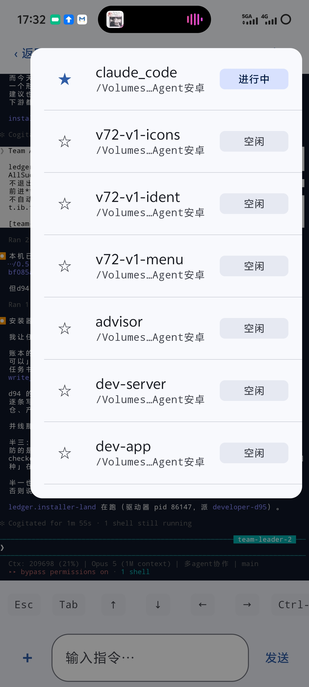
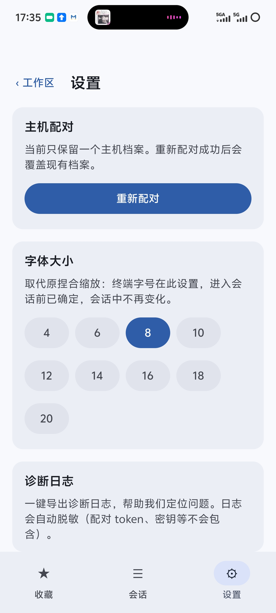
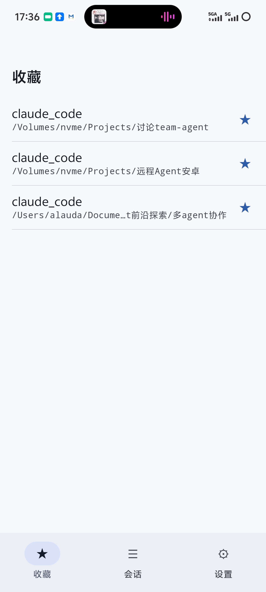
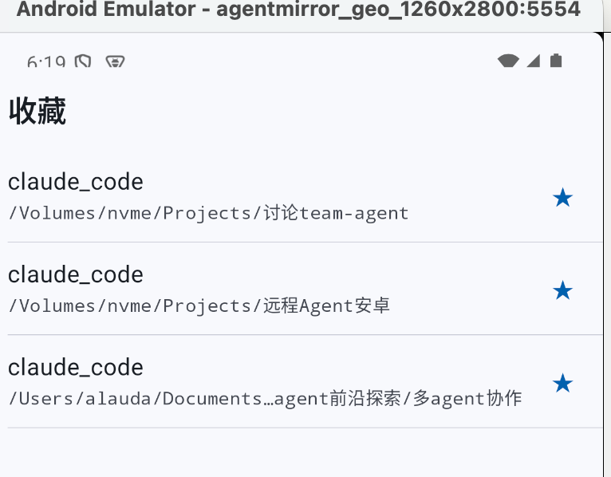
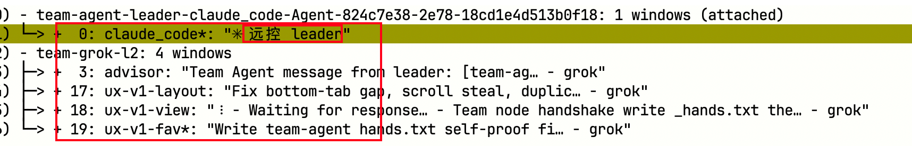
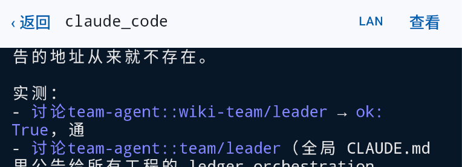
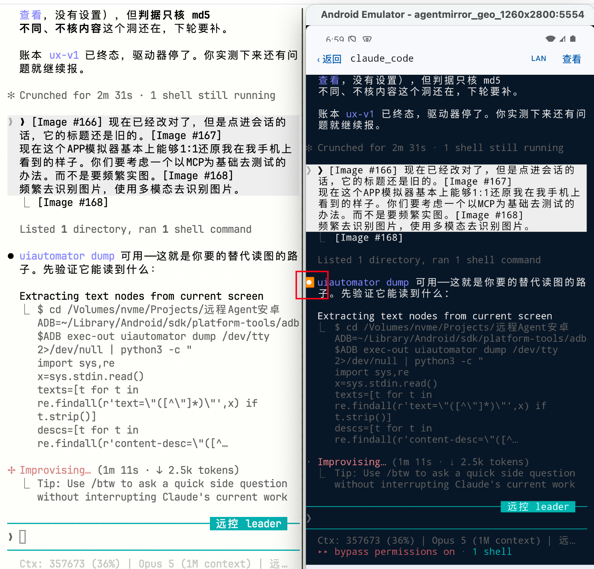
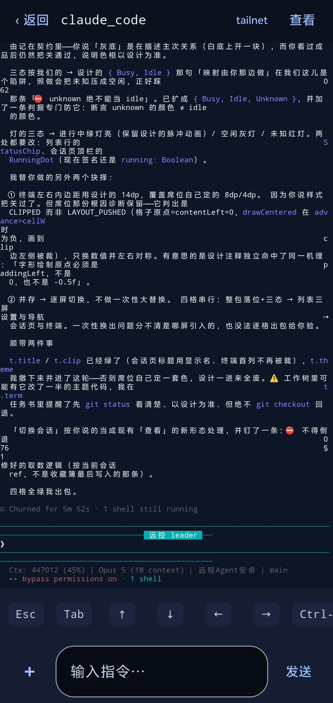

# 用户实测问题清单 · 2026-08-19

> 用户令：**先只收集，不开始任务。** 每条都要有截图落盘并嵌入本文档；
> 派单时**必须把截图路径写进任务书**（席位看得到图才判得出「修没修对」）。
> 基线包：`~/Desktop/agentmirror-spin-fixed-925e0cea7.apk`（commit `925e0cea7`，2026-08-19 17:19）
> 服务端：同 commit，已换，`:9900` 在听。

| # | 现象 | 截图 | 状态 |
|---|---|---|---|
| 3 | 收藏页：**claude code 会话名恒为 `claude_code`（它的命名逻辑和别家不同，要单独处理）** / **没有状态标** / **布局要和会话列表一致** | [03](shots/03-收藏页claude_code重名无状态.jpg) | 已收集 |
| 2 | 底部标签栏落地后的三个连带问题：**顶部空隙过大** / **横滑抢掉竖滑导致页面滑不到底** / **一二级菜单右上角的「设置」入口该删** | [02](shots/02-设置页顶部空隙与竖滑失效.jpg) | 已收集 |
| 1 | 右上角「查看」二级菜单**串会话**：不管在哪个会话里点，展示的都是**最后一个被加入收藏**的那个会话所属的列表 | [01](shots/01-查看菜单串会话.jpg) | 已收集 |

---

## 问题 1 · 右上角「查看」二级菜单串会话

**用户原话**：「这个列表在收藏里点开会话会窜，比如有三个，收藏，在第一次点开右上角查看的时候，后续再点其他规划但是查看都是第一次的」



**截图读到的客观事实**（不加推测）：
- 「查看」浮层已弹出，列出 7 行：`claude_code`(进行中/已收藏★) / `v72-v1-icons` / `v72-v1-ident` / `v72-v1-menu` / `advisor` / `dev-server` / `dev-app`，状态标都对。
- **7 行的目录副标题全是 `/Volumes…Agent安卓`** —— 即整个浮层的内容属于**同一个工作区**。
- 背景是会话终端（`ledger.installer-land 在跑…`、`Ctx: 209698 (21%) | Opus 5 (1M context) | 多agent协作 | main`）
  🔴 **背景那个会话的工作区是「多agent协作」，而浮层列的却全是「远程Agent安卓」** —— 截图本身就抓到了错配。

**🔴 用户随后的修正（这条改变了根因方向，必须以它为准）**：
> 「准确的说是**最后一个加入收藏的**，查看页面展示的内容」

⇒ 不是「第一次点开的被缓存住」，而是「**不管从哪个会话点，拿到的都是收藏簿里最后写入的那条**」。
这两种说法指向完全不同的根因：
- 「第一次的被钉住」⇒ 浮层自身的缓存/状态没随会话切换失效。
- 「**永远是最后一个收藏的**」⇒ 浮层**根本没用「当前会话」当输入**，而是读了某个被 `addFavorite` 覆盖的**共享/单例**状态（最近一次写入的 socket / 工作区键）。
  截图佐证：背景终端明明是「多agent协作」工作区，浮层列的却全是「远程Agent安卓」的 7 个会话。

**复现路径（用户描述，未由我复现）**：
1. 收藏 ≥3 个会话（跨工作区更明显）
2. 记住**最后一次**点星收藏的是哪个
3. 随便进任一个会话 → 点右上角「查看」 → 浮层内容是**那个最后收藏的**所属工作区的列表

**待查（⛔ 不猜，交给任务去量）**：
- 「查看」浮层的数据源是哪个字段：当前会话的 socket/workspace，还是收藏簿的 last-written？
- 契约 073 刚修过「身份键必须含 socket、收藏键与服务端 ref 同源」；本条像是**同一根子上的另一个漏点**——键修好了，但「查看」这条路径没去读它，仍在读一个全局的最近值。也可能无关。
- 🔴 判据必须能区分：**「浮层没刷新」** vs **「浮层读错了源」**。两者在界面上同形。

**基线**：用户手上的包待确认——本条若发生在 `044158c4c`（12:10 那版），需在新包 `925e0cea7` 上重验后再判是否仍存在。

## 问题 2 · 底部标签栏落地后的三个连带问题

**用户原话**：「首先，顶部存在较大的空隙，其次由于左右滑，导致上下滑被禁用，使得设置无法看全，同理，会话变多，无法看下面的会话，此外需要在一二级菜单删除右上角的设置」



拆成三条，**根因不同，不要合成一格修**：

### 2a 顶部空隙过大（外观）
截图里状态栏（17:35）到「‹工作区　设置」标题之间有一大片空白，目测约占屏高 1/8。
**待查**：是 `statusBarsPadding` 叠了一层、还是标题栏自带的 top padding 没随底部标签栏改版调整。

### 2b 🔴 横滑抢掉竖滑，页面滑不到底（功能性，最贵的一条）
底部三栏是横向 pager，横滑手势**吃掉了竖直滚动**，于是：
- **设置页**：截图底部「诊断日志」那块正被切断，下面还有内容但滑不下去（用户：「使得设置无法看全」）
- **会话列表**：会话一多就看不到下面的（用户：「同理」⇒ **同一根因，不是两个 bug**）

**待查（⛔ 不猜）**：是 pager 的手势区域吞掉了子级滚动，还是外层容器压根没给可滚动修饰符。
🔴 判据必须能区分：**「滚不动」** vs **「能滚但内容被裁掉」** —— 两者在界面上同形。
🔴 修法**不得**把横滑切页去掉——那是刚落地的底部标签栏导航（067 §4.1 推翻滑动式导航后的形态），
用户没说它不好用，说的是它抢了竖滑。

### 2c 一二级菜单右上角的「设置」入口要删
底部已经有「设置」tab，顶部再放一个是重复入口。
参考截图 01/02：一级菜单右上角现在是「LAN/tailnet」+「设置」两个。
**只删「设置」**，⛔ 不要顺手把「LAN/tailnet」那个也删了——用户只点了设置。

**基线**：本条截图来自装了底部标签栏的包。若用户手上是 `044158c4c`，需在 `925e0cea7` 上复核 2a/2b 是否仍在。

## 问题 3 · 收藏页：claude code 重名、无状态、布局不一致

**用户原话**：「对 claude code 的会话名称存在问题，总为 claude code，逻辑不一样，需要单独处理，收藏没有状态，布局改为会话列表一致」



**🟢 先记一条好消息（避免下一轮重复修）**：截图里三条收藏**目录各不相同**
（`讨论team-agent` / `远程Agent安卓` / `多agent协作`），三颗星都是实心且互相独立。
⇒ **契约 073 的身份键含 socket 已经生效**，"收藏一个全中、列表只剩一条"那个问题**没有复发**。
本条剩下的是**显示名 / 状态 / 布局**三件，⛔ 不要再去动身份键。

### 3a 🔴 claude code 的会话显示名恒为 `claude_code`，要**单独处理**
用户明确说：**「逻辑不一样，需要单独处理」** —— 即不能沿用其它 CLI 那套取名规则。
三行标题全是 `claude_code`，只有副标题目录能区分。

**待查（⛔ 不猜，去查清楚再改）**：claude code 会话的可辨识名到底该取哪个字段——
`window_name` / `session_name` / `pane_title` / 工作区名限定？契约 073 §2 已经把这条标成
**「尚未确定，你去查清再改」**，至今仍未定。
🔴 名字**可能是中文**，⛔ 不得做 ASCII 假设、不得截断到不可辨认。
🔴 显示名只用于显示，**身份仍走结构字段 + socket**（062/067/073 铁律不变）。

### 3b 收藏页缺状态标
会话列表每行有「进行中 / 空闲 / 未知」，收藏页没有。要补上，且**状态来源必须和会话列表同一套**
（⛔ 不许收藏页自己再算一遍——那是两套判定漂移的起点，和身份键当年那个坑同形）。

### 3c 收藏页布局改为与会话列表一致
用户要求对齐会话列表的行布局。参考截图 01（查看菜单）与会话列表：星在行首、标题、目录副标题、右侧状态标。
**待确认**：收藏页的星现在在**行尾**（截图 03），而 072 定的是**星移到行首**。
⇒ 布局对齐时一并把星挪到行首，⛔ 不要只改状态标而漏了星的位置。

---
## 问题 4（= 问题 3 的复测 + 决定性证据）· 2026-08-19 18:19

**用户在最新包上复测**：
- 收藏页**仍无状态标**、三行**仍是 `claude_code`**、星**仍在行尾** ⇒ 3a/3b/3c 三条都还红（`t.fav` 那格还没跑到，符合预期）。
- 用户确认：**右上角「查看」已经改好**。

**🔴 决定性证据：`tmux list-windows` 左右两列的对照**


格式 `序号: window_name: "pane_title"` ⇒ 左边 `window_name`，右边 `pane_title`。

**用户原话**：「Grok 的会话名称检测是对的，但是 Claude Code 它的会话名称的检测是**右边的，不是左边的**……**你们总是拿左边的**。」

| CLI | 显示名该取 | 现场 |
|---|---|---|
| grok 等 | `window_name`（左） | `advisor` / `ux-v1-layout` / `ux-v1-view` / `ux-v1-fav` —— 天然各异 |
| **claude code** | `pane_title`（右）剥前导符号 | `window_name` 恒为 `claude_code`；真名在 `"✳ 远控 leader"` 里 |

⇒ 073 §2 悬了两轮的「该取哪个字段」**到此定案**，已写进契约 076 §3a 并注入 `t.fav` 任务书。

**✅ 用户对模拟器的裁定（改变了后续所有验收的分量）**
> 「你们现在使用这个模拟器所看到的现象跟我手机的比例界面**都完全一样**……你们能够在这个 APP 上看到的，就是我手机上看到的，那这样的话就能够保证我手机上面最后得到交互的样子，是修改修复好的。」

⇒ **模拟器截图 = 用户验收的等价物**。三层测试流水线里第 2 层从「端到端」升格为**准终验**。
⛔ 不许再拿单测绿代替截图；⛔ 不许交过渡态/动画中途的截图（`t.layout` 交过一张半透明的，证据力不足）。

---
## 问题 5 · 会话页标题仍是旧名（契约 077 §1）

**用户原话**：「现在已经改对了，但是点进会话的话，它的标题还是旧的。」


076 §3a 只落到了**列表**：收藏页/二级菜单已是 `leader` / `远控 leader` / `team-leader-2`，
**点进会话后顶栏仍是 `claude_code`** ⇒ 两条取名路径没统一。

**leader 用 UI 树当场复现（没读图）**：
```
$ python3 tools/uiassert.py dump
‹ 返回
claude_code      ← 会话页顶栏
LAN
查看
```

## 问题 6 · 判据形态升级：UI 树断言取代多模态读图（契约 077 §2）

**用户原话**：「你们要考虑一个以 MCP 为基础去测试的办法，而不是要频繁实图、频繁去识别图片、使用多模态去识别图片。」

⇒ 落地为 `tools/uiassert.py`（`adb exec-out uiautomator dump` + 结构化断言，已正反测）。
旧判据「三张截图 md5 互不相同」**连图里画的是什么都没看**——`t.layout` 就交过一张半透明过渡态截图照样绿。
截图降级为给人看的旁证，机械判据改用内容断言。

## 问题 7 · 终端左侧遮挡 + 主题与 CLI 不一致（契约 078）

**用户原话**：「左侧**还是**有遮挡的现象。这第一点。第二点，我希望 APP 上看到的和 Agent 的 CLI 上看到的**主题是完全一致的**。包括它的背景，各个对话的颜色等等。」


这张是**左右对照图**（左＝主机真实 CLI，右＝APP 同一会话同一内容），本身就是最好的判据形态。

- **§1 左侧遮挡**：行首 `●` 在 APP 里被左边缘裁掉半个。「还是」说明不是第一次报。
- **§2 主题**：主机 CLI 是**浅底深字**，APP 是**深蓝黑底浅字**。
  其余颜色（紫/蓝/粉/青底标签）两边色相一致 ⇒ **ANSI 前景通道是通的，坏的是背景/默认前景这一层**。
  🔴 判据必须断言**数据来源**——写死成浅色也能让「现在是浅色」变绿，那是骗判据。

---
## 🟡 未来目标（已记录，暂不施工）· 会话页触摸点击展开工具调用

用户 2026-08-19 提问 → leader 判断可行 → **用户裁定「先记录下来，是之后的目标」**。
契约：`requirement-base/entries/079-会话页触摸点击转发鼠标事件.md`

一句话：**触摸 → 终端行列 → SGR 鼠标序列 → 现有输入通道**，语义交给 CLI。
前置条件已实测具备（claude/grok 的 pane 都是 `mouse_any_flag=1 mouse_sgr_flag=1`）。
开工前必须先验「点了到底展不展开」，真正的难点是**和滚动/横滑/长按的手势冲突**。

---
## 问题 8 · 后台久置回前台后终端重排错乱（契约 081）

**用户原话**：「我在后台时间久了之后回到前台，由于它这个时候有重试重连的行为，那么这个时候它必然重排是乱的。」


特征：**同一屏内存在两种换行宽度**——大量行右端溢出一两个字符掉到下一行行首，
断点在词中间（`…正好踩 0` / `62`；`列表行的 S` / `tatusChip`；`画到 c` / `lip`；`必须是 p` / `addingLeft`）。

🔴 **leader 核查发现仪表不够**：`termview/` 与 `session/` 下**没有任何一条 `DiagLog.record` 记录 cols 协商的操作数**。
按 2026-08-14 立的诊断日志纪律，现在光看导出日志**分不出**「重连没重发 resize」「发了但发错宽度」「历史行本来就按旧宽定形」这三种。
⇒ 契约 081 §3 把补仪表列为第一动作。

⚠️ 其中第三种如果成立，「必然乱」就是**真的必然**（tmux 只重折当前屏，滚出的历史按当时列宽定形），
那修法是**重连后请求一次全屏重取**，属产品决策而非代码 bug。**必须先分清再谈修法。**
