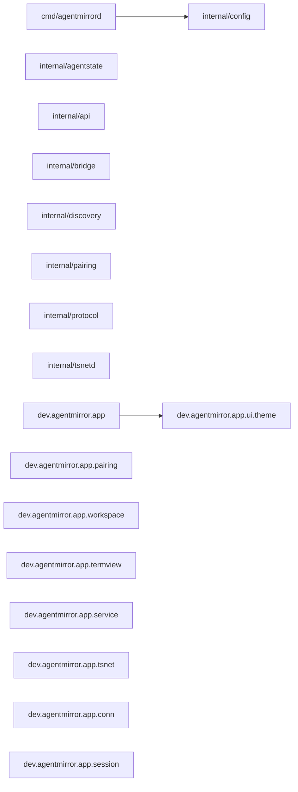

# 架构维基（自动生成）

> ⚠️ **生成物，勿手改。** 本文件由 `tools/archwiki/build_wiki.py` 从源码现算生成，改源码后重跑 `python3 tools/archwiki/build_wiki.py` 刷新；重跑无 diff（幂等）。人工改动会被覆盖。

扫描 **18** 个包（Go 9 + Kotlin 9）、**2** 条包间依赖边。

## 判据结果

| 判据 | 说明 | 结果 |
|---|---|---|
| T1-1 | 无环（9 个 Go 包） | ✅ 通过 |
| T1-2 | Go 9 包、Kotlin 9 包均有模块 doc | ✅ 通过 |
| _预留_ | 零消费者 / 孤儿子图 | 未落地（进 --check 前须配红测） |

## 总依赖图

## 包架构卡

### Go · cmd/agentmirrord

- **职责**：Command agentmirrord is the service-side daemon of remote-agent agentmirror (working title): a sidecar that mirrors the user's existing tmux sessions to the Android app over WebSocket.
- **导出面**：main
- **依赖边**：internal/config

### Go · internal/agentstate

- **职责**：Package agentstate maps per-agent CLI output and process trees to a normalized state (working/idle/blocked/done), degrading to unknown when undecidable.
- **导出面**：（无导出符号）
- **依赖边**：（无）

### Go · internal/api

- **职责**：Package api implements the service-side WebSocket API and the image upload endpoint, wiring together discovery and bridge.
- **导出面**：（无导出符号）
- **依赖边**：（无）

### Go · internal/bridge

- **职责**：Package bridge exposes a single tmux pane as a terminal bridge: first-frame snapshot, incremental output stream, input injection, and resize.
- **导出面**：ErrPaneNotFound, ErrServerUnreachable, ErrTmuxTimeout, NewPane, Pane
- **依赖边**：（无）

### Go · internal/config

- **职责**：Package config loads the daemon configuration from command-line flags and environment variables.
- **导出面**：Config, Load
- **依赖边**：（无）

### Go · internal/discovery

- **职责**：Package discovery enumerates every tmux server socket on the host and aggregates their sessions and panes into the two-level workspace model (requirements 001 and 002).
- **导出面**：DefaultSocketDirs, Discover, DiscoverWithDirs, Model, Pane, Workspace
- **依赖边**：（无）

### Go · internal/pairing

- **职责**：Package pairing implements token-based device pairing and QR-code onboarding for the Android app.
- **导出面**：（无导出符号）
- **依赖边**：（无）

### Go · internal/protocol

- **职责**：Package protocol defines the wire contract between the Android app and the agentmirrord service.
- **导出面**：AgentState, Auth, AuthAck, BinaryHeaderLen, BinaryKind, BinaryMagic, BinaryMaxPayloadLen, BinaryMaxRefLen, BinaryPayload, DecodeBinary, DefaultBinarySessionRefLen, EncodeBinary, Envelope, ErrBadMagic, ErrBadPayload, ErrInvalidCount, ErrInvalidField, ErrInvalidGeometry, ErrInvalidRef, ErrInvalidState, ErrMissingVersion, ErrRefTooLong, ErrTruncated, ErrUnknownKind, ErrUnknownType, ErrUnsupportedVersion, ErrorCode, ErrorFrame, FrameType, Input, InputAck, InputFailReason, List, ListDelta, Listing, MarshalFrame, Resize, Scrollback, Session, Subscribe, Typed, UnmarshalFrame, Unsubscribe, UploadResp, Workspace
- **依赖边**：（无）

### Go · internal/tsnetd

- **职责**：Package tsnetd embeds Tailscale networking (tsnet) so the daemon's WebSocket service is reachable over the tailnet as well as the LAN.
- **导出面**：DefaultDir, ErrTailnetDisabled, Group, New, Options
- **依赖边**：（无）

### Kotlin · dev.agentmirror.app

- **职责**：Compose 应用根组合。
- **导出面**：AgentMirrorApp, MainActivity
- **依赖边**：dev.agentmirror.app.ui.theme
- **doc 全文**：Compose 应用根组合。 骨架期仅渲染占位文案；正式导航（两级导航：舰队 → 会话，见需求 001） 由 workspace 任务在 [AgentMirrorTheme] 内接管。

### Kotlin · dev.agentmirror.app.ui.theme

- **职责**：品牌主色：深蓝（终端深夜配色基调，与资源 colors.xml 一致）。
- **导出面**：AgentMirrorTheme
- **依赖边**：（无）

### Kotlin · dev.agentmirror.app.pairing

- **职责**：配对：扫码连接（路线 a：QR 载服务端地址 + 配对 token，可选 TS authkey，需求 011）。
- **导出面**：（无导出符号）
- **依赖边**：（无）
- **doc 全文**：配对：扫码连接（路线 a：QR 载服务端地址 + 配对 token，可选 TS authkey，需求 011）。 负责相机扫码、地址解析与配对握手；替代"终端 App + Tailscale App + SSH 配置"三件套 （需求 001 单一 App 原则）。本包为占位骨架，由 pairing 任务落位实现。

### Kotlin · dev.agentmirror.app.workspace

- **职责**：工作区：两级导航（舰队 → 会话），对应需求 001「舰队视角」。
- **导出面**：（无导出符号）
- **依赖边**：（无）
- **doc 全文**：工作区：两级导航（舰队 → 会话），对应需求 001「舰队视角」。 首屏展示主机上全部 tmux 会话（舰队列表），下钻进入单个会话页。 本包为占位骨架，由 workspace 任务落位实现。

### Kotlin · dev.agentmirror.app.termview

- **职责**：终端渲染：VT 解析 + 快照/增量渲染（60fps 本地滚动，需求 006）。
- **导出面**：（无导出符号）
- **依赖边**：（无）
- **doc 全文**：终端渲染：VT 解析 + 快照/增量渲染（60fps 本地滚动，需求 006）。 终端内核（Apache-2.0 兼容来源）规划在 :terminal 模块，本包承载 Compose 侧 渲染画布与快照增量同步。本包为占位骨架，由 termview 任务落位实现。

### Kotlin · dev.agentmirror.app.service

- **职责**：前台服务：常驻连接 + 通知栏（需求 004 Android 前台服务路线）。
- **导出面**：（无导出符号）
- **依赖边**：（无）
- **doc 全文**：前台服务：常驻连接 + 通知栏（需求 004 Android 前台服务路线）。 承载与主机 sidecar 的长连接生命周期，系统杀进程后由 Activity 重连恢复 （客户端无状态，冷启动 1 秒内恢复画面）。本包为占位骨架，由 service 任务落位实现。

### Kotlin · dev.agentmirror.app.tsnet

- **职责**：内嵌 Tailscale 联网（需求 007/011 路线 a：服务端/App 内嵌 tailscale）。
- **导出面**：（无导出符号）
- **依赖边**：（无）
- **doc 全文**：内嵌 Tailscale 联网（需求 007/011 路线 a：服务端/App 内嵌 tailscale）。 提供 LAN 之外的可达通道，QR 可选携带 TS authkey 以自举组网。 本包为占位骨架，由 tsnet 任务落位实现（App 侧为 Tailscale Android SDK 封装）。

### Kotlin · dev.agentmirror.app.conn

- **职责**：连接层：与主机 sidecar 的 WebSocket 连接、会话枚举、帧协议编解码。
- **导出面**：（无导出符号）
- **依赖边**：（无）
- **doc 全文**：连接层：与主机 sidecar 的 WebSocket 连接、会话枚举、帧协议编解码。 传输协议见需求 011 裁定：JSON 控制帧（列表/订阅/输入/resize/scrollback/状态）+ 二进制终端流帧。本包为占位骨架，由 conn 任务落位实现。

### Kotlin · dev.agentmirror.app.session

- **职责**：会话页：单个 tmux 会话的交互界面。
- **导出面**：（无导出符号）
- **依赖边**：（无）
- **doc 全文**：会话页：单个 tmux 会话的交互界面。 组合终端渲染（termview）与输入下发（conn），承载缩放、手势与快捷输入条。 本包为占位骨架，由 session 任务落位实现。
