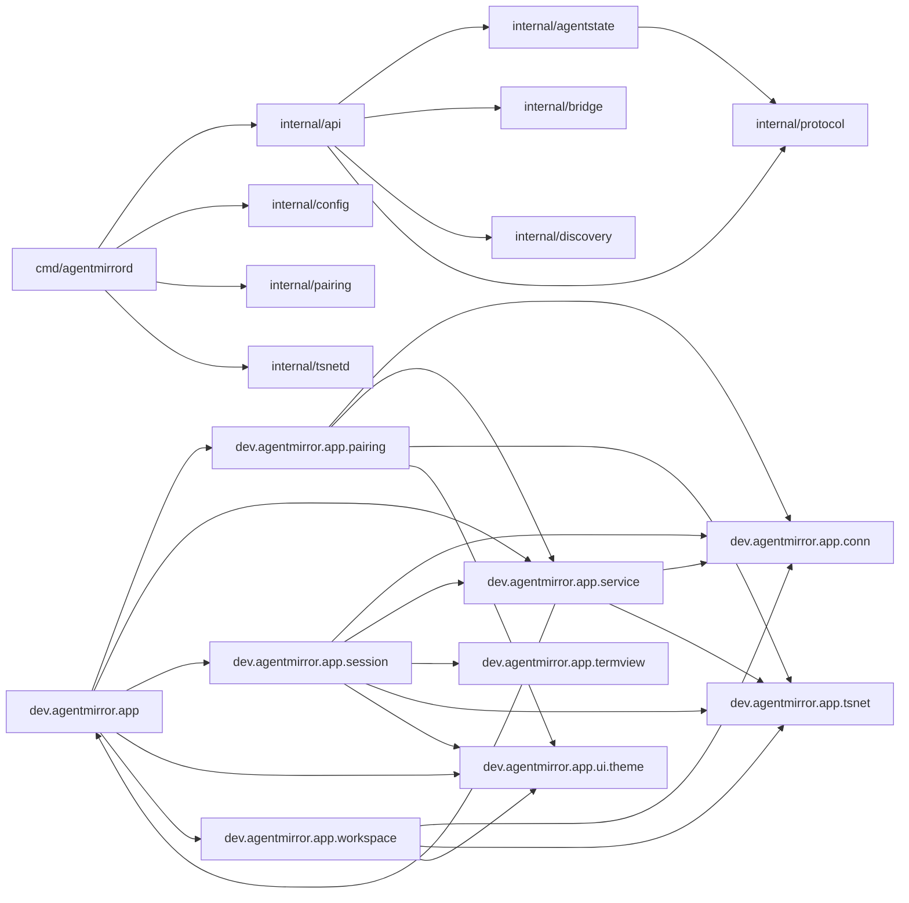

# 架构维基（自动生成）

> ⚠️ **生成物，勿手改。** 本文件由 `tools/archwiki/build_wiki.py` 从源码现算生成，改源码后重跑 `python3 tools/archwiki/build_wiki.py` 刷新；重跑无 diff（幂等）。人工改动会被覆盖。

扫描 **18** 个包（Go 9 + Kotlin 9）、**29** 条包间依赖边。

## 判据结果

| 判据 | 说明 | 结果 |
|---|---|---|
| T1-1 | 无环（9 个 Go 包） | ✅ 通过 |
| T1-2 | Go 9 包、Kotlin 9 包均有模块 doc | ✅ 通过 |
| _预留_ | 零消费者 / 孤儿子图 | 未落地（进 --check 前须配红测） |

## 总依赖图

## 包架构卡

### Go · cmd/agentmirrord

- **职责**：Command agentmirrord is the service-side daemon of AgentMirror (product github.com/agentmirror/agentmirror): a sidecar that mirrors the user's existing tmux sessions to the Android app over WebSocket.
- **导出面**：main
- **依赖边**：internal/api, internal/config, internal/pairing, internal/tsnetd

### Go · internal/agentstate

- **职责**：Package agentstate maps per-agent CLI output and process trees to a normalized state (working/idle/blocked/done), degrading to unknown when undecidable.
- **导出面**：Adapter, AgentKind, ClaudeCodeAdapter, CodexAdapter, Confidence, DefaultRegistry, Identify, IdentifyInput, Proc, Registry, Sample, State, Track
- **依赖边**：internal/protocol

### Go · internal/api

- **职责**：Package api implements the service-side WebSocket API and the image upload endpoint, wiring together discovery and bridge (task ws-api).
- **导出面**：Discoverer, NewServer, NewStateProvider, Options, Server, StateProvider, TokenValidator
- **依赖边**：internal/agentstate, internal/bridge, internal/discovery, internal/protocol

### Go · internal/bridge

- **职责**：Package bridge exposes a single tmux pane as a terminal bridge: first-frame snapshot, incremental output stream, whole-message input injection with a decidable ack, resize, and scrollback paging.
- **导出面**：ErrInvalidKey, ErrPaneNotFound, ErrServerUnreachable, ErrTmuxTimeout, NewPane, Pane
- **依赖边**：（无）

### Go · internal/config

- **职责**：Package config loads the daemon configuration from command-line flags and environment variables.
- **导出面**：Config, Load
- **依赖边**：（无）

### Go · internal/discovery

- **职责**：Package discovery enumerates every tmux server socket on the host and aggregates their sessions and panes into the two-level workspace model (requirements 001 and 002).
- **导出面**：DefaultSocketDirs, Discover, DiscoverWithDirs, Model, Pane, Workspace
- **依赖边**：（无）

### Go · internal/pairing

- **职责**：Package pairing implements token-based device pairing and QR-code onboarding for the Android app.
- **导出面**：Address, DetectAddresses, EnsureToken, GenerateToken, KindLAN, KindLoopback, KindTailnet, LoadToken, NewPayload, NewPayloadWithCandidates, Onboarding, Payload, PayloadVersion, PrimaryHost, PrintOnboarding, PrintOnboardingAll, PrintOnboardingWith, RenderQR, SaveToken, TokenDir, WSURL, WithTailnet
- **依赖边**：（无）

### Go · internal/protocol

- **职责**：Package protocol defines the wire contract between the Android app and the agentmirrord service.
- **导出面**：AgentState, Auth, AuthAck, BinaryHeaderLen, BinaryKind, BinaryMagic, BinaryMaxPayloadLen, BinaryMaxRefLen, BinaryPayload, DecodeBinary, DefaultBinarySessionRefLen, EncodeBinary, Envelope, ErrBadMagic, ErrBadPayload, ErrInvalidCount, ErrInvalidField, ErrInvalidGeometry, ErrInvalidRef, ErrInvalidState, ErrMissingVersion, ErrRefTooLong, ErrTruncated, ErrUnknownKind, ErrUnknownType, ErrUnsupportedVersion, ErrorCode, ErrorFrame, FrameType, Input, InputAck, InputFailReason, Key, List, ListDelta, Listing, MarshalFrame, Resize, Scrollback, Session, Subscribe, Typed, UnmarshalFrame, Unsubscribe, UploadResp, Workspace
- **依赖边**：（无）

### Go · internal/tsnetd

- **职责**：Package tsnetd embeds Tailscale networking (tsnet) so the daemon's WebSocket service is reachable over the tailnet as well as the LAN.
- **导出面**：DefaultDir, ErrTailnetDisabled, Group, New, Options
- **依赖边**：（无）

### Kotlin · dev.agentmirror.app

- **职责**：Compose 应用根组合。
- **导出面**：AgentMirrorApp, MainActivity, MainNavState, Session
- **依赖边**：dev.agentmirror.app.pairing, dev.agentmirror.app.service, dev.agentmirror.app.session, dev.agentmirror.app.ui.theme, dev.agentmirror.app.workspace
- **doc 全文**：Compose 应用根组合。 依需求 004「客户端无状态」，本组件只做路由，不持有任何业务状态。 首启路由（pairing-ui 知识基底 §1）： - 无配对配置 → 配对页（扫码/手填，可跳过进空工作区）； - 有配对配置 → 直进工作区列表； - 配对页可从设置/重配入口重进（重新配对）。 会话页跳转沿用 session-ui 挂载的 [SessionRoute]。 导航态由 [navState]（D-3 修复）注入：MainActivity 在 onSaveInstanceState 持久化、重建恢复，深链/旋转都不丢导航位置（审计 D-2/D-3）。 工作区 VM（[workspaceViewModel]）由 MainActivity 持有（fix-workspace-wiring 修复， navState 同模式提升），本组件只负责在工作区分支用 [DisposableEffect] 把它接入 [ServiceWire.uiConnector]——配对成功后列表能渲染（此前 VM 裸建从未接线，uiConnector 全仓无调用点，见 fix-workspace-wiring 知识基底）。

### Kotlin · dev.agentmirror.app.ui.theme

- **职责**：品牌主色：深蓝（终端深夜配色基调，与资源 colors.xml 一致）。
- **导出面**：AgentMirrorTheme, DarkStateTones, LightStateTones, LocalStateTones, MonoFontFamily, Spacing, StateTone, StateTones
- **依赖边**：（无）

### Kotlin · dev.agentmirror.app.pairing

- **职责**：配对：扫码连接（路线 a：QR 载服务端地址 + 配对 token，可选 TS authkey，需求 011）。
- **导出面**：Failed, Pairing, PairingConfig, PairingConfigStore, PairingFailCause, PairingRoute, PairingScreen, PairingViewModel, QrParseException, QrPayload, QrPayloadParser, SharedPreferencesPairingConfigStore
- **依赖边**：dev.agentmirror.app.conn, dev.agentmirror.app.service, dev.agentmirror.app.tsnet, dev.agentmirror.app.ui.theme
- **doc 全文**：配对：扫码连接（路线 a：QR 载服务端地址 + 配对 token，可选 TS authkey，需求 011）。 负责相机扫码、地址解析与配对握手；替代"终端 App + Tailscale App + SSH 配置"三件套 （需求 001 单一 App 原则）。本包为占位骨架，由 pairing 任务落位实现。

### Kotlin · dev.agentmirror.app.workspace

- **职责**：工作区：两级导航（舰队 → 会话），对应需求 001「舰队视角」、002「两级分组」。
- **导出面**：ConnectionUi, SessionUi, StateBadge, StateBadgeStyle, WorkspaceScreen, WorkspaceUi, WorkspaceUiState, WorkspaceViewModel
- **依赖边**：dev.agentmirror.app.conn, dev.agentmirror.app.tsnet, dev.agentmirror.app.ui.theme
- **doc 全文**：工作区：两级导航（舰队 → 会话），对应需求 001「舰队视角」、002「两级分组」。 - [WorkspaceViewModel]：纯 JVM 视图模型，消费 conn 层 listing/list_delta 帧流 → UI 状态；聚合字段（session_count / aggregate_state）为服务端权威值，只渲染不重算（012）。 - [WorkspaceScreen] / [StateBadge]：薄 Compose 渲染层；状态徽章五值（008）。 二级导航进入会话页由根路由（AgentMirrorApp）占位跳转，会话页归 session-ui 任务。

### Kotlin · dev.agentmirror.app.termview

- **职责**：终端渲染：快照/增量渲染 + 本地滚动视口（60fps，需求 006）。
- **导出面**：ANSI_COLORS, GlyphFallbackPolicy, GlyphFontProvider, GlyphRunBuilder, GlyphSegment, GlyphSlot, TermSurfaceView, TermViewPresenter, XTERM_256
- **依赖边**：（无）
- **doc 全文**：终端渲染：快照/增量渲染 + 本地滚动视口（60fps，需求 006）。 [TermViewPresenter] 纯 JVM 视口状态机（跟随/锁定历史、可见行窗口、捏合行列数换算、 脏区合并），单测全部打在它上；[TermSurfaceView] 薄 Android 层（Canvas 画格、拖动/捏合 手势、Choreographer 帧调度）。内核为 :terminal 模块；resize 协议帧由上层接线（conn/session）。

### Kotlin · dev.agentmirror.app.service

- **职责**：前台服务：常驻连接 + 通知栏（需求 004 Android 前台服务路线）。
- **导出面**：MirrorForegroundService, NetworkConnectivityWatcher, NoopTransportFactory, NotificationHelper, OkHttpTransportFactory, OkHttpWebSocketTransport, ServiceWire, StateWatcher, TsnetBootstrap
- **依赖边**：dev.agentmirror.app, dev.agentmirror.app.conn, dev.agentmirror.app.tsnet
- **doc 全文**：前台服务：常驻连接 + 通知栏（需求 004 Android 前台服务路线）。 分层（fg-service 知识基底 §1）： - [StateWatcher]：纯 JVM 核心逻辑（验收单测全打这里），消费 conn 层 listing/list_delta 流，检测会话状态沿变化（→blocked/→done）→ 通知；同状态重复抑制；unknown 不通知。 - [NotificationHelper]：通知渠道（常驻/状态两条）+ 常驻通知与状态通知 + 会话页深链 PendingIntent。 - [MirrorForegroundService]：薄 Android 层，startForeground（dataSync）+ 生命周期绑定 [ConnectionManager]（经 [ServiceWire]）；断连静默重连归 conn 层，本服务只反映状态。 - [ServiceWire]：接线点——传输工厂（默认 [NoopTransportFactory]）、UI 监听桥、连接配置注入。 电量策略（004 裁定）：仅在有活跃订阅或用户开启后台守望时运行前台服务；服务被系统杀 → 冷启动重连即恢复（客户端无状态，没有丢失可言）。UI/配对层经 [ServiceWire] 控制启动/停止。

### Kotlin · dev.agentmirror.app.tsnet

- **职责**：内嵌 Tailscale 联网（需求 007/011 路线 a：服务端/App 内嵌 tailscale）。
- **导出面**：ConnectionPath, Environment, Error, GomobileTsnetBackend, NetIfSnapshot, TsnetAuthKeys, TsnetBackend, TsnetDial, TsnetInterfaceCodec, TsnetManager, TsnetProxy, TsnetProxySocketFactory, TsnetSocks, TsnetSocksAuthenticator, TsnetWire, Up
- **依赖边**：（无）
- **doc 全文**：内嵌 Tailscale 联网（需求 007/011 路线 a：服务端/App 内嵌 tailscale）。 提供 LAN 之外的可达通道：QR 可选携带 TS authkey，[TsnetManager] 用它在 App 进程内起 tsnet 用户态节点（gomobile 绑定 libs/tsnetbind.aar，无 VpnService、 零系统权限），Up 后经 [TsnetDial] 给 OkHttp 配 loopback SOCKS5 即达 tailnet。 分层（native 隔离红线）：[TsnetBackend] 薄适配接口 → [GomobileTsnetBackend] 唯一触达 native；状态机/authkey 校验/dial 选择均纯 JVM 可测。 路线裁定与实测数字见 docs/decisions/app-tsnet.md。

### Kotlin · dev.agentmirror.app.conn

- **职责**：连接层：与主机 sidecar 的 WebSocket 连接、会话枚举、帧协议编解码。
- **导出面**：AgentState, AuthAckFrame, AuthFrame, BinaryFrame, BinaryFrameCodec, BinaryKind, Clock, Connection, ConnectionConfig, ConnectionManager, ConnectionState, ErrorCode, ErrorFrame, FrameCodec, FrameDecodeException, FrameEncodeException, FrameError, InputAckFrame, InputFailReason, InputFrame, InputKey, ListDeltaFrame, ListFrame, Listener, ListingFrame, ProtocolVersion, Real, ReconnectPolicy, ResizeFrame, ScrollbackFrame, Session, SubscribeFrame, TransportListener, UnsubscribeFrame, WebSocketTransport, Workspace
- **依赖边**：（无）
- **doc 全文**：连接层：与主机 sidecar 的 WebSocket 连接、会话枚举、帧协议编解码。 分层（自底向上）： 1. [FrameCodec] / [BinaryFrameCodec] —— 纯函数编解码：JSON 控制帧（信封 + 12 类帧 载荷，docs/protocol.md §4）+ 二进制流帧（§6，含 scrollback 12 字节收敛区间头）。 编解码都消费同一份契约夹具做字节级断言（server/internal/protocol/testdata/）。 2. [Connection] —— 单条 WS 生命周期状态机（握手 → 就绪 → 关闭）。 3. [ConnectionManager] —— 重连策略 + 订阅簿记：重连后自动重放 auth + 全部活跃 subscribe（004 无状态铁律的重放语义）；listing seq 不连续 → 自动重新 list。 上层（UI/service）只见 Flow/回调，不见 WS 细节。本层不持久任何会话状态。

### Kotlin · dev.agentmirror.app.session

- **职责**：会话页：单个 tmux 会话的交互界面。
- **导出面**：Attachment, Failed, Failure, HttpUrlConnectionUploader, SessionRoute, SessionScreen, SessionViewModel, Success
- **依赖边**：dev.agentmirror.app.conn, dev.agentmirror.app.service, dev.agentmirror.app.termview, dev.agentmirror.app.tsnet, dev.agentmirror.app.ui.theme
- **doc 全文**：会话页：单个 tmux 会话的交互界面。 组合终端渲染（termview）与输入下发（conn），承载缩放、手势与快捷输入条。 本包为占位骨架，由 session 任务落位实现。
